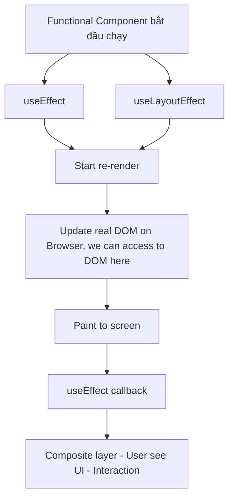

# useLayoutEffect

## 1. useLayoutEffect là gì?

> `useLayoutEffect` là một Hook tương tự như `useEffect`, nhưng nó chạy ngay sau khi DOM đã được update nhưng trước khi trình duyệt hoạt động lại render trên màn hình.

## 2. Khi nào sử dụng `useLayoutEffect`?

- Khi cần truy cập vào thông tin về layout và muốn thực hiện các thay đổi ngay lập tức trước khi người dùng nhìn thấy giao diện người dùng.
- Khi bạn cần thực hiện các tác vụ đồng bộ liên quan đến DOM như chạy các animation hoặc thay đổi các thuộc tính CSS. Ví dụ, bạn có thể muốn thay đổi màu sắc của một phần tử DOM dựa trên một điều kiện.
- Khi browser có hiện tượng flicker do state change quá nhanh.

Không nên dùng `useLayoutEffect` để thực hiện các effect như fetchAPI rồi set lại state, vì dùng `useLayoutEffect` chạy đồng bộ, nó sẽ làm app bị blocking. Hầu hết các effect chúng ta không cần tạm ngưng để chạy, có thể chạy bất đồng bộ, vậy nên dùng useEffect thì hợp lý hơn.

## 3. Cú pháp:

```js
useLayoutEffect(() => {
  // effect
  return () => {
    // cleanup
  };
}, [dependencies]);
```

## 4. Lưu ý:

- `useLayoutEffect` là Hook, nên chúng ta chỉ có thể gọi nó ở cấp cao nhất của component hoặc trong một Hook khác. Không thể gọi `useLayoutEffect` bên trong một function hoặc vòng lặp.
- Khi có `strict mode` React sẽ chạy **extra development-only setup+cleanup cycle** trước khi cấu hình thực.
- Effect chỉ chạy trên client, nó không chạy khi mà server rendering.

## 5. Tiến trình chạy:

#### useEffect:

- Update state.
- Update DOM (mutation).
- Re-render UI (layout, paint).
- Call cleanup function (nếu dependencies thay đổi)
- Call useEffect callback.

#### useLayoutEffect:

- Update state.
- Update DOM (mutation).
- Call cleanup function (nếu dependencies thay đổi)
- Call useLayoutEffect callback.
- Re-render UI (layout, paint).


